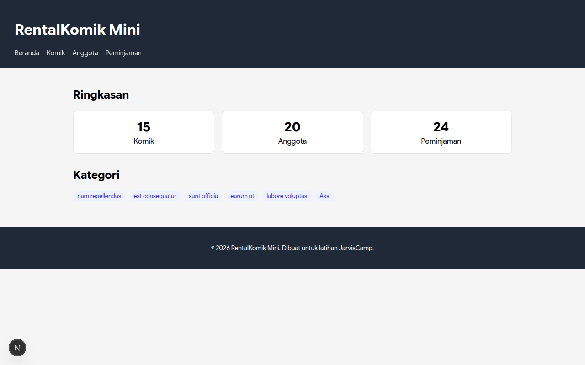
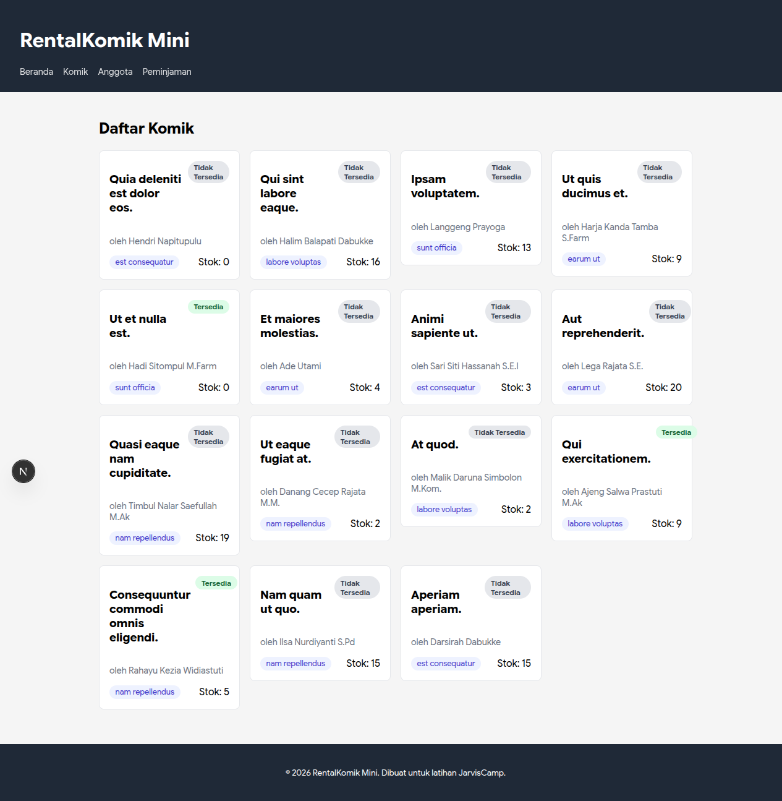
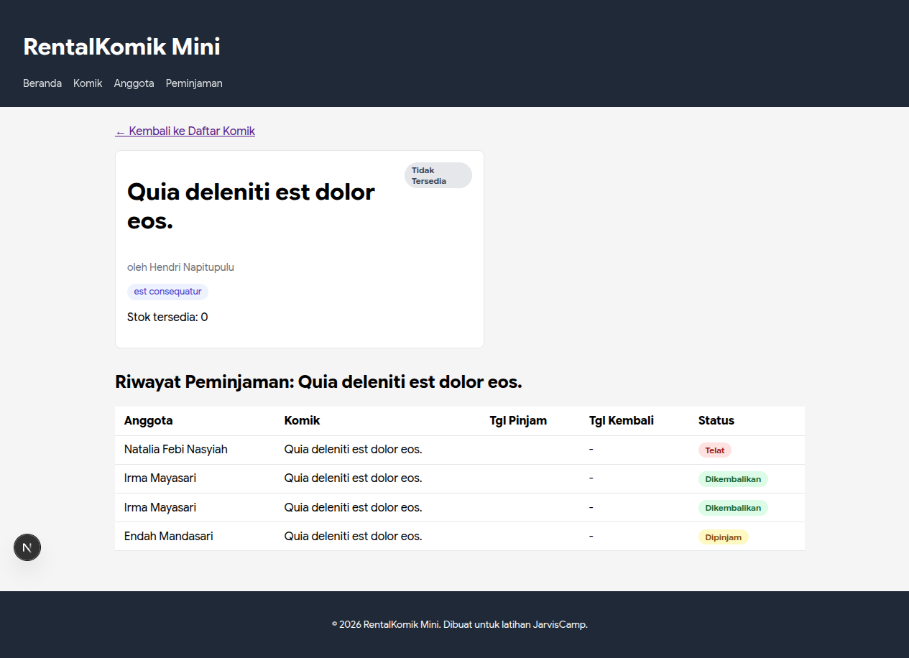
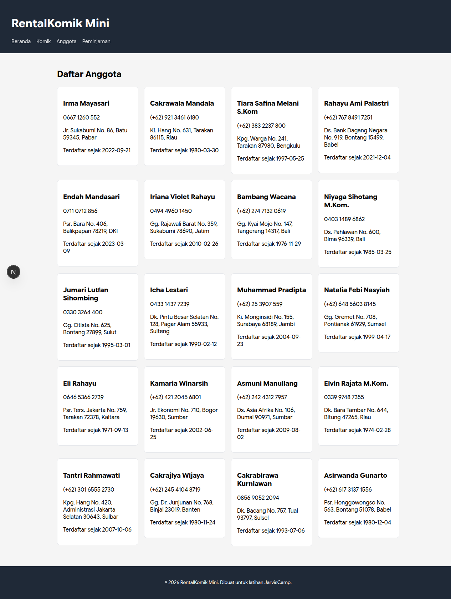
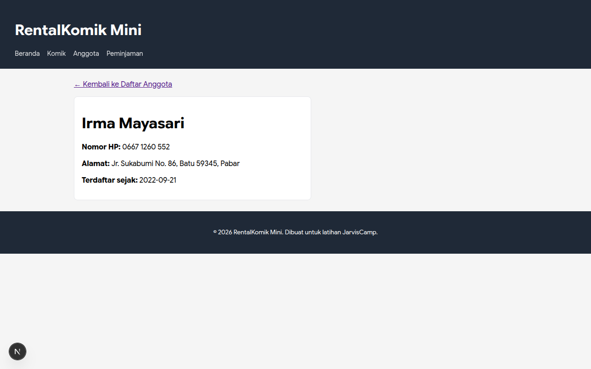
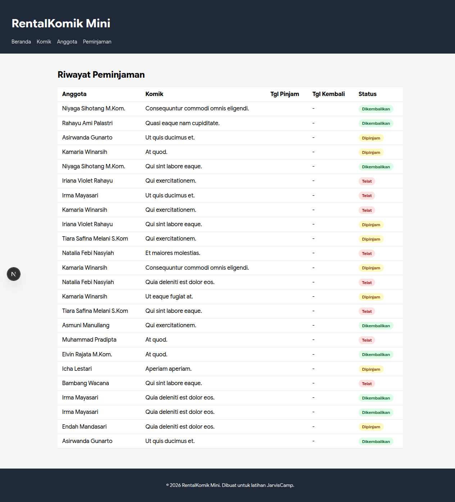
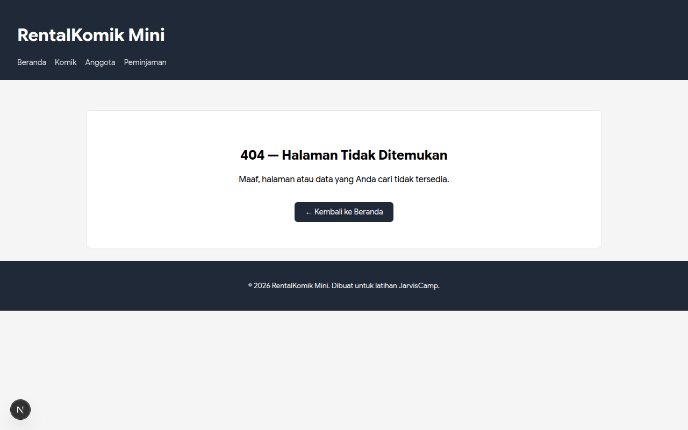

# RentalKomik Mini — Frontend Next.js

Proyek dashboard rental komik berbasis Next.js (App Router) dan TypeScript yang mengonsumsi REST API backend Laravel. Proyek ini dikerjakan sebagai pemenuhan Tugas Praktikum Pekan 9 JarvisCamp: "Migrasi Dashboard ke Next.js (App Router) — TypeScript".

---

## Daftar Isi

- [Deskripsi Proyek](#deskripsi-proyek)
- [Teknologi yang Digunakan](#teknologi-yang-digunakan)
- [Struktur Direktori](#struktur-direktori)
- [Pemenuhan Tugas Praktikum](#pemenuhan-tugas-praktikum)
  - [Bagian A — Praktikum Inti](#bagian-a--praktikum-inti)
  - [Bagian B — Fitur Tambahan](#bagian-b--fitur-tambahan)
- [Dokumentasi & Hasil Tugas (Tangkapan Layar)](#dokumentasi--hasil-tugas-tangkapan-layar)
- [Panduan Instalasi dan Menjalankan](#panduan-instalasi-dan-menjalankan)
- [Verifikasi dan Pengujian](#verifikasi-dan-pengujian)

---

## Deskripsi Proyek

Aplikasi RentalKomik Mini menyediakan antarmuka dashboard untuk mengelola dan memantau aktivitas rental komik secara real-time dari backend Laravel. Fitur utama mencakup ringkasan statistik, katalog komik, daftar anggota, pencatatan peminjaman, serta detail riwayat peminjaman per komik dan per anggota.

---

## Teknologi yang Digunakan

- **Framework:** Next.js 16 (App Router)
- **Library UI:** React 19
- **Bahasa:** TypeScript 5
- **Styling:** CSS Modular / Tailwind CSS v4
- **Backend API:** Laravel REST API (dengan autentikasi Bearer Token)

---

## Struktur Direktori

```text
├── docs/
│   ├── screenshots/              # Tangkapan layar seluruh halaman
│   └── tugas-pekan-9.md          # Dokumen instruksi tugas praktikum
├── src/
│   ├── app/
│   │   ├── anggota/
│   │   │   ├── [id]/
│   │   │   │   └── page.tsx      # Halaman detail anggota (Bagian B)
│   │   │   └── page.tsx          # Halaman daftar anggota
│   │   ├── komik/
│   │   │   ├── [id]/
│   │   │   │   └── page.tsx      # Detail komik + riwayat pinjam (Bagian B)
│   │   │   └── page.tsx          # Halaman daftar komik
│   │   ├── peminjaman/
│   │   │   └── page.tsx          # Halaman tabel riwayat peminjaman
│   │   ├── globals.css           # Styling terpusat aplikasi
│   │   ├── layout.tsx            # Root layout, header, footer, navigasi
│   │   ├── not-found.tsx         # Custom 404 page (Bagian B)
│   │   └── page.tsx              # Halaman beranda / ringkasan statistik
│   ├── components/
│   │   ├── AnggotaCard.tsx       # Kartu profil anggota
│   │   ├── DaftarAnggota.tsx     # Grid daftar kartu anggota
│   │   ├── DaftarKomik.tsx       # Grid daftar kartu komik
│   │   ├── KategoriChip.tsx      # Badge chip kategori komik
│   │   ├── KomikCard.tsx         # Kartu informasi komik
│   │   ├── Navigasi.tsx          # Navigasi utama antarmuka
│   │   ├── PageSection.tsx       # Pembungkus section halaman
│   │   ├── PeminjamanRow.tsx     # Baris tabel peminjaman
│   │   ├── StatusBadge.tsx       # Badge status (tersedia, dipinjam, telat, dll.)
│   │   └── TabelPeminjaman.tsx   # Tabel riwayat peminjaman
│   ├── lib/
│   │   └── api.ts                # Generic fetcher dan pemanggilan API backend
│   └── types/
│       └── index.ts              # Interface TypeScript (Kategori, Komik, Anggota, Peminjaman)
├── .env.local                    # Konfigurasi environment variabel
├── package.json
└── tsconfig.json
```

---

## Pemenuhan Tugas Praktikum

### Bagian A — Praktikum Inti

1. **Setup Project:** Next.js dengan App Router dan TypeScript (`tsconfig.json`).
2. **Tipe Data (`src/types/index.ts`):** Interface `Kategori`, `Komik`, `Anggota`, dan `Peminjaman`.
3. **Environment (`.env.local`):** Menyimpan `API_BASE_URL` dan `API_TOKEN`.
4. **Client API (`src/lib/api.ts`):** Fungsi generik `fetchAPI<T>` dengan header Authorization Bearer token dan cache `no-store`.
5. **Komponen Presentational Bertipe (`src/components/`):**
   - `StatusBadge`
   - `KategoriChip`
   - `KomikCard`
   - `DaftarKomik`
   - `AnggotaCard`
   - `DaftarAnggota`
   - `PeminjamanRow`
   - `TabelPeminjaman`
   - `PageSection`
   - `Navigasi`
6. **Root Layout (`src/app/layout.tsx`):** Header dengan judul aplikasi, navigasi, slot konten utama, dan footer.
7. **Halaman Beranda (`src/app/page.tsx`):** Ringkasan jumlah komik, anggota, peminjaman, serta daftar kategori langsung dari backend.
8. **Halaman Komik:**
   - `/komik` (`src/app/komik/page.tsx`): Katalog seluruh komik.
   - `/komik/[id]` (`src/app/komik/[id]/page.tsx`): Detail komik dengan penanganan `notFound()`.
9. **Halaman Anggota dan Peminjaman:**
   - `/anggota` (`src/app/anggota/page.tsx`): Daftar anggota rental.
   - `/peminjaman` (`src/app/peminjaman/page.tsx`): Tabel peminjaman komik.
10. **Styling (`src/app/globals.css`):** Desain antarmuka responsif dan konsisten.

### Bagian B — Fitur Tambahan

Ketiga opsi latihan mandiri diimplementasikan secara lengkap:

1. **Detail Anggota Bertipe:**
   - Endpoint client: `getAnggotaById` di `src/lib/api.ts`.
   - Halaman: `src/app/anggota/[id]/page.tsx` dengan penanganan `notFound()` bila ID tidak valid.
   - Link interaktif pada setiap kartu anggota di `src/components/DaftarAnggota.tsx`.
2. **Custom Halaman 404:**
   - Dibuat di `src/app/not-found.tsx` dengan pesan informatif dan tombol navigasi kembali ke Beranda.
3. **Riwayat Peminjaman per Komik:**
   - Pada `src/app/komik/[id]/page.tsx`, data peminjaman difilter berdasarkan kesesuaian `judul_komik` dan ditampilkan menggunakan `TabelPeminjaman`.

---

## Dokumentasi & Hasil Tugas (Tangkapan Layar)

Bagian ini berisi tangkapan layar (screenshot) sebagai bukti penyelesaian seluruh tugas praktikum dan fitur tambahan.

### 1. Halaman Beranda (Ringkasan Statistik & Kategori)

- **Hasil Halaman Beranda:**
  

### 2. Halaman Katalog Komik

- **Hasil Daftar Komik:**
  

### 3. Halaman Detail Komik & Riwayat Peminjaman (Fitur Bagian B)

- **Hasil Detail Komik dan Riwayat Pinjam:**
  

### 4. Halaman Daftar Anggota

- **Hasil Daftar Anggota:**
  

### 5. Halaman Detail Anggota (Fitur Bagian B)

- **Hasil Detail Anggota:**
  

### 6. Halaman Tabel Peminjaman

- **Hasil Tabel Peminjaman:**
  

### 7. Custom Halaman 404 / Not Found (Fitur Bagian B)

- **Hasil Custom Halaman 404:**
  

---

## Panduan Instalasi dan Menjalankan

### 1. Prasyarat

- Node.js versi 18 atau lebih baru.
- Backend Laravel berjalan pada `http://localhost:8000` dengan API token yang valid.

### 2. Konfigurasi Environment

Pastikan berkas `.env.local` telah dibuat di root proyek:

```env
API_BASE_URL=http://localhost:8000/api
API_TOKEN=token_api_sanctum_anda
```

### 3. Instalasi Dependensi

```bash
npm install
```

### 4. Menjalankan Server Pengembangan

```bash
npm run dev
```

Aplikasi dapat diakses di [http://localhost:3000](http://localhost:3000).

---

## Verifikasi dan Pengujian

Jalankan perintah berikut untuk memastikan integritas kode sebelum commit:

- **Pemeriksaan Tipe TypeScript:**
  ```bash
  npx tsc --noEmit
  ```
- **Pemeriksaan Linter ESLint:**
  ```bash
  npm run lint
  ```
- **Kompilasi Produksi:**
  ```bash
  npm run build
  ```
